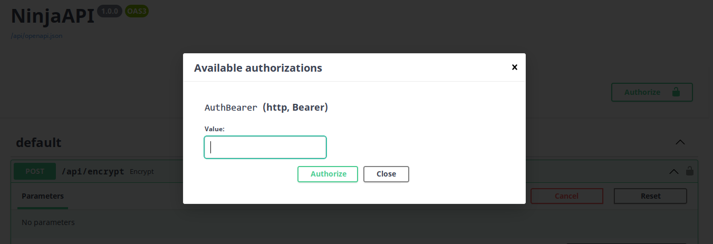
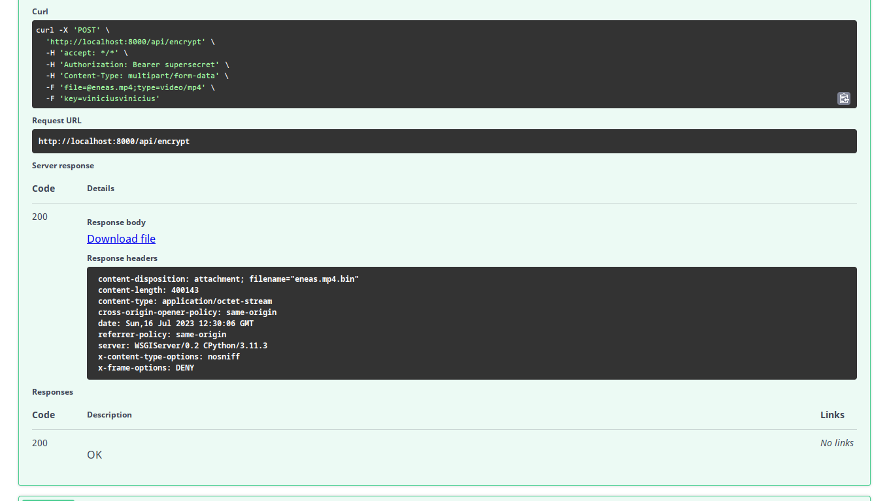

# encrypt-video
- Encrypt files  with python lib pycryptodome.
- Django-Ninja, encrypting mp4 files with symmetric key.


## Environment Variables
- create a file called .env, add this line:
```KEY=your_secretkey```


## Install Dependencies
```pip install -r requirements.txt```

## Run Project
- in terminal run this command.
```uvicorn core.asgi:application --reload```

## EndPoints
- Using the **post** method to send the mp4 file and the password (size 16). returns an encrypted .bin file.
**`http://localhost:8000/api/encrypt`**


- **decrypt file**, Using the **post** method to send the encrypted file with the key. returns the decrypted video.
**`http://localhost:8000/api/decrypt`**


## Docs openapi

**AUTH**
- authenticate with your secretkey
---

---

**ENCRYPT**
---


---
**DECRYPT**
---


