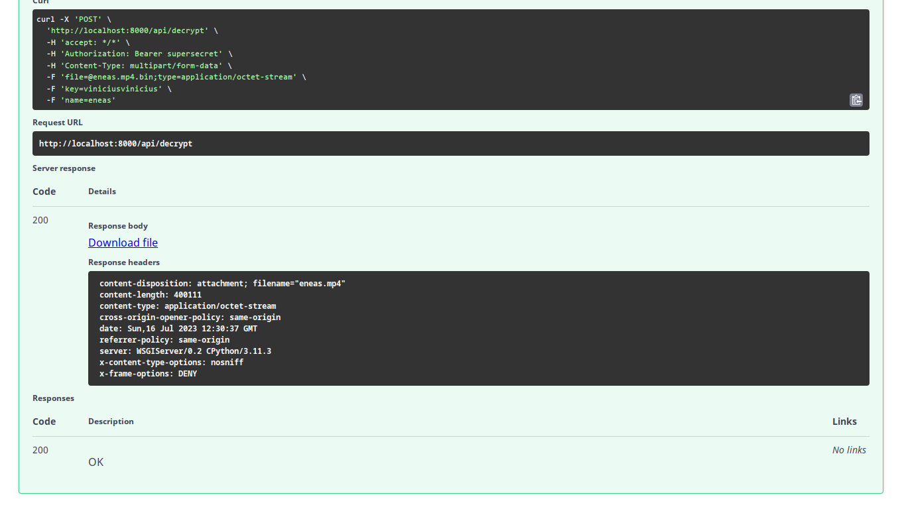

# encrypt-video
- Encrypt files  with python lib pycryptodome.
- Django-Ninja, encrypting mp4 files with symmetric key.

## Install Dependencies
```pip install -r requirements.txt```

## Run Project
- in terminal run this command.
```uvicorn core.asgi:application --reload```

## EndPoints
- Using the **post** method to send the mp4 file and the password (size 16). A zip file containing the encrypted file and the verification key (a 32 bytes file) is returned.
**`http://localhost:8000/api/encrypt`**


- **decrypt file**, Unzip the file and make a post, attaching the encrypted file and the key.bin (in that order), along with the password and the name of the mp4 file.
**`http://localhost:8000/api/decrypt`**


## Docs openapi

**ENCRYPT**
---


---
**DECRYPT**
---



